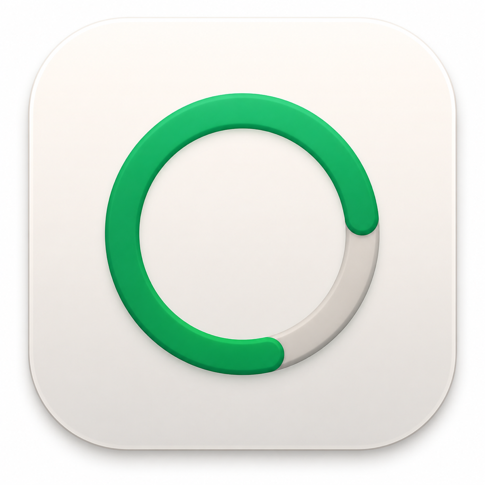
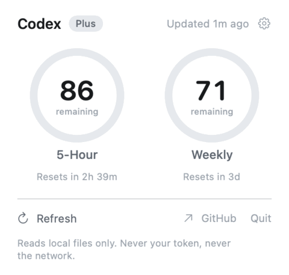

<p align="center">
  
</p>
<h1 align="center">Codex Gauge</h1>
<p align="center">
  <b>Your Codex usage limits, always in the menu bar —<br>without ever spending a token to check them.</b>
</p>
<p align="center">
  <a href="https://github.com/ruby1304/codex-gauge/releases/latest"></a>
  
  <a href="LICENSE"></a>
  <a href="https://github.com/ruby1304/codex-gauge/stargazers"></a>
</p>
<p align="center">
  
</p>

A tiny native **macOS menu-bar app** that shows your **Codex (ChatGPT) usage** — the 5-hour window and the weekly window — as live gauges, with reset countdowns and low-quota alerts.

## Why it's different

Most usage trackers **poll an API** on a timer. That spends requests, can trip rate limits, and — for some providers — risks getting your account flagged. **Codex Gauge never makes a single network call.** It reads the rate-limit snapshot that the Codex CLI *already writes to your local session logs*.

> ### A usage meter that doesn't consume usage.

It never touches your token, works even when the Codex app is closed, and the whole thing is a ~400-line local file read you can audit.

## vs. Codex's own usage display

|  | Codex's built-in menu | **Codex Gauge** |
|---|---|---|
| Where | buried in the account menu | **always in your menu bar** |
| Visible when Codex is closed | ✗ | **✓** |
| Look | one line of text | **live gauge rings** |
| Cost to check your usage | — | **zero · pure local read** |
| Low-quota notifications | ✗ | **✓** |

## Features

- **◔ Live gauges** for the 5-hour and weekly windows, with "resets in 2h 14m" countdowns.
- **🔔 Low-quota alerts** — a system notification when either window drops below your threshold.
- **⚙️ Settings** — Codex path, refresh interval, alert threshold.
- **⚡ Optional "force refresh"** — off by default. It's the *only* thing that ever spends a sliver of quota (it asks Codex for a fresh number), and it's clearly labeled. Everyone else stays 100% free.
- **🔒 100% local** — no API calls, never reads your token, MIT licensed.

## Install

### Download (recommended)
1. Grab `CodexGauge.app.zip` from the [**Releases**](https://github.com/ruby1304/codex-gauge/releases) page, unzip, and drag `CodexGauge.app` to `/Applications`.
2. First launch: right-click the app → **Open** (it's open-source and unsigned), or run:
   ```sh
   xattr -dr com.apple.quarantine /Applications/CodexGauge.app
   ```
3. Look at your menu bar — `◔ 71%`. Click it for the gauges.

### Build from source
```sh
git clone https://github.com/ruby1304/codex-gauge.git
cd codex-gauge/app && ./build.sh run
```
Needs the Swift toolchain (Xcode **Command Line Tools** — no full Xcode required).

## How it works

Every Codex API response carries your current rate-limit state, and the Codex CLI persists it into each session log at `~/.codex/sessions/YYYY/MM/DD/rollout-*.jsonl` as a `rate_limits` object:

```json
{ "rate_limits": {
    "primary":   { "used_percent": 2.0,  "window_minutes": 300,   "resets_at": 1780992992 },
    "secondary": { "used_percent": 29.0, "window_minutes": 10080,  "resets_at": 1781142220 },
    "plan_type": "prolite" } }
```

`primary` is the 5-hour rolling window, `secondary` is the weekly window. Codex Gauge finds the newest session log, reads the last `rate_limits` block, and shows `100 − used_percent` as "remaining." That's the whole thing — a local file read. The numbers refresh for free whenever Codex actually runs.

**Freshness:** the snapshot is from the last time Codex ran. If you haven't used Codex in a while it reads older — but if Codex isn't running, your quota isn't moving either. If you genuinely need an up-to-the-second value, enable **force refresh** in Settings (it spends a tiny bit of quota by asking Codex once).

## Prefer a menu-bar-script setup?

There's also a zero-dependency **SwiftBar / xbar plugin** in [`swiftbar/`](swiftbar/) — same local data source, ~80 lines of Python, if you'd rather not run a standalone app.

## Privacy & safety

- **No network.** The app never calls any API or endpoint (except the opt-in force refresh, which runs the Codex CLI itself).
- **No credentials.** It never reads `~/.codex/auth.json` or any token.
- **Local only.** It reads session-log files you already have. Nothing leaves your machine.

## Credits

- The same local `rate_limits` source is also used by [`xiangz19/codex-ratelimit`](https://github.com/xiangz19/codex-ratelimit) (CLI/TUI).
- App icon generated with Codex's own image model — dogfooding all the way down.

## License

MIT © 2026 ruby1304
